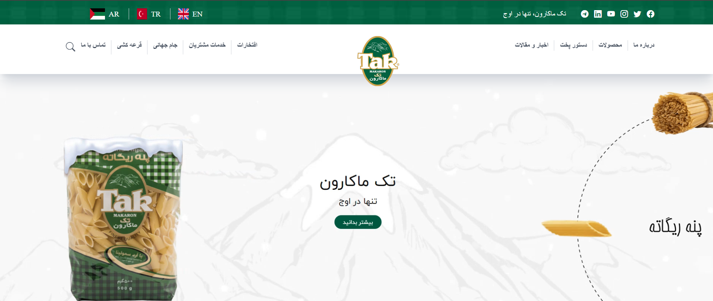

 

  

  <h3 align="center">this project is an example of Takmakaron site</h3>

  

    <a href="https://github.com/Razieh-rmrady/takmakaron-react">View Demo</a>
    .
    <a href="https://github.com/Razieh-rmrady/takmakaron-react/issues">Report Bug</a>
    .
    <a href="https://github.com/Razieh-rmrady/takmakaron-react/issues">Request Feature</a>
  

      

## About The Project

## Built With

build with Html, Css, Tailwind, js ,react.js, and it has been clean the code, we happy with star and follow in linkedin, enjoy coding.

### Creating A Pull Request

## Authors

* **Razieh Moradi** - ** - [Razieh Moradi](https://github.com/rmrady/takmakaron-react) - **

## Acknowledgements

* [ShaanCoding](https://github.com/ShaanCoding/)
* [Othneil Drew](https://github.com/othneildrew/Best-README-Template)
* [ImgShields](https://shields.io/)
